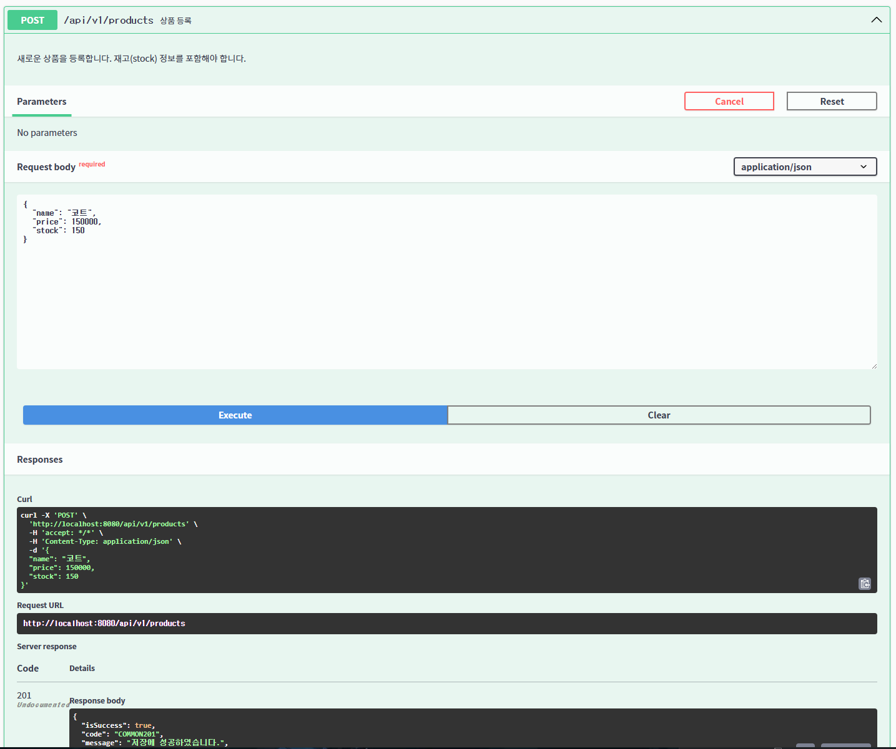
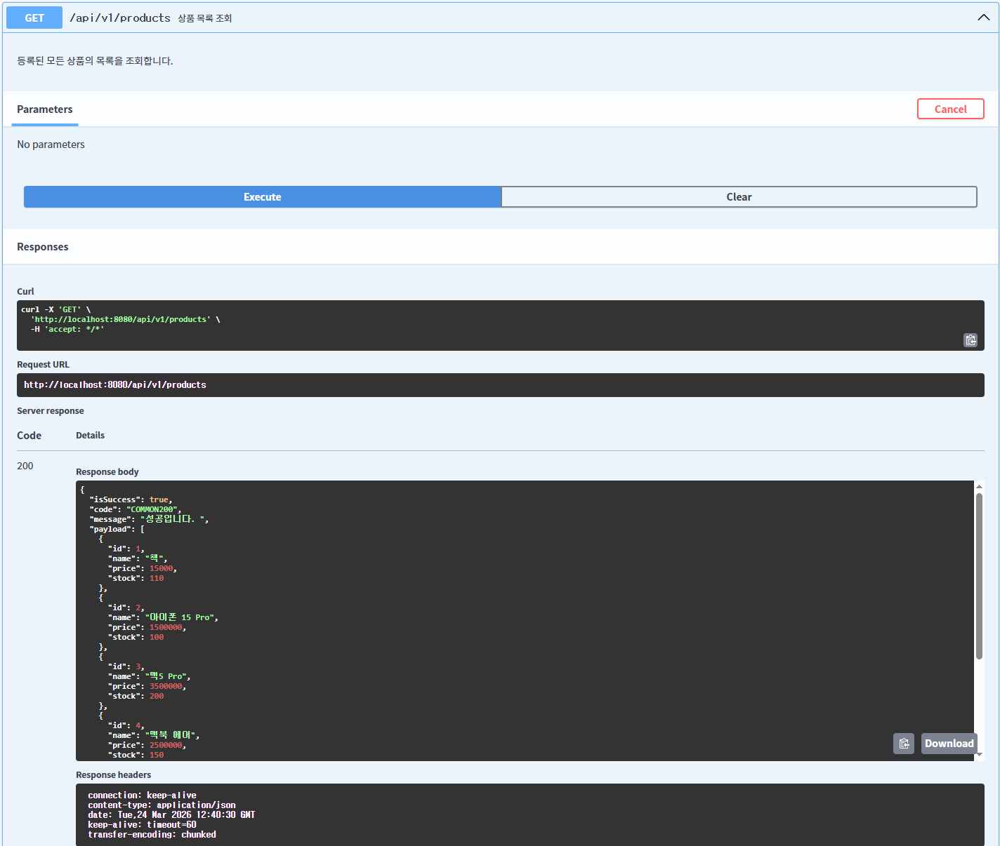
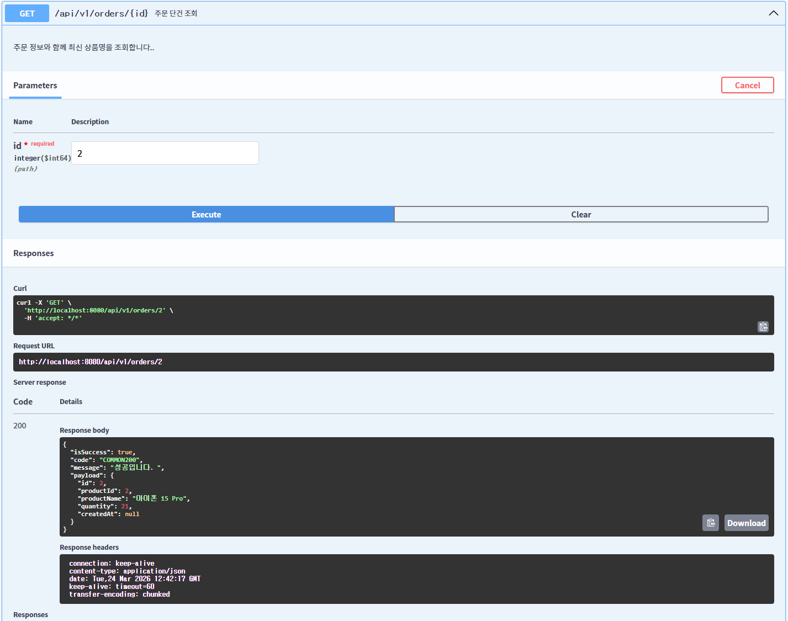
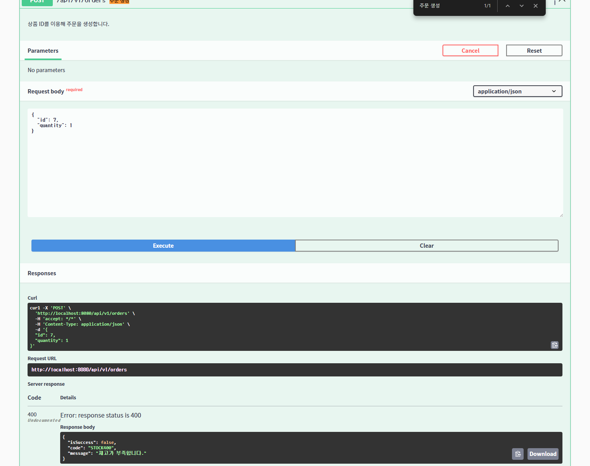
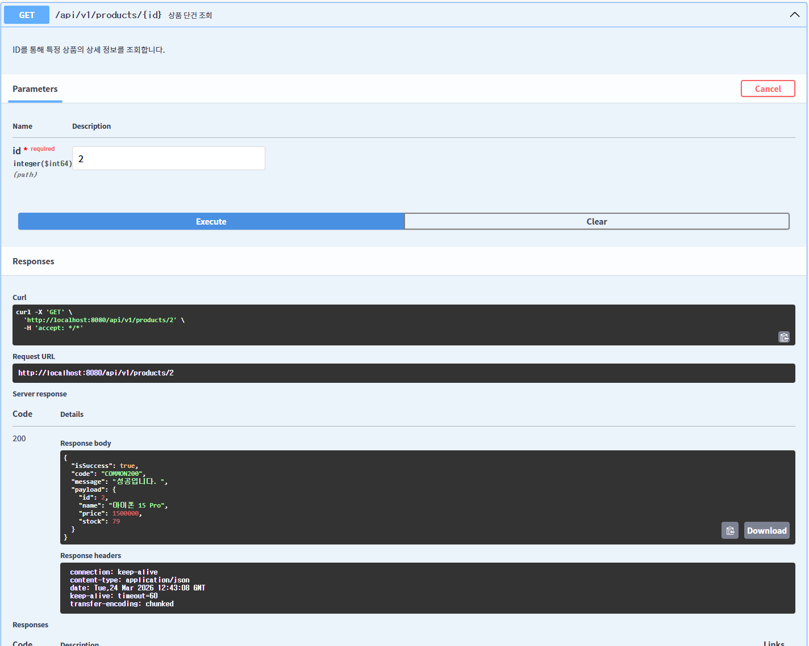

# 📦 Simple Order Management Service
상품 관리와 주문 처리의 핵심 로직을 구현한 스프링 부트 애플리케이션입니다.


---

## ✨ Key Features (STAR)

### 1. 상품(Product) CRUD 및 동적 이름 반영
- **Situation**: 주문 조회 시 상품 이름을 별도로 저장하면, 상품명 변경 시 기존 주문에 반영되지 않는 문제
- **Task**: 상품명 변경이 기존 주문 조회에도 즉시 반영되도록 구조를 설계해야 된다.
- **Action**: 주문에 상품명을 복사해서 저장하지 않고, `@ManyToOne` 연관관계로 상품을 직접 참조하도록 설계하여 조회 시 `order.getProduct().getName()`으로 항상 최신 이름을 가져온다.
- **Result**: 상품명을 수정하면 해당 상품으로 생성된 모든 주문 조회에 변경된 이름이 자동으로 반영된다.

---

### 2. 주문 목록 페이징 및 N+1 문제 해결 (도전 과제)
- **Situation**: 주문 목록 조회 시 `@ManyToOne(fetch = LAZY)` 설정으로 인해 주문 수만큼 상품 조회 쿼리가 추가 실행되는 N+1 문제가 발생한다.
- **Task**: 목록 조회 시 N+1 없이 한 번의 쿼리로 주문과 상품 정보를 함께 가져와야 한다.
- **Action**: `@Query`에 `join fetch`를 적용해 주문과 상품을 한 번에 조회하도록 하고 페이지네이션을 `Page`와 `Slice` 두 가지 버전으로 구현했다. 
            `Page`는 `countQuery`를 분리해 fetch join과의 충돌을 방지했고, `Slice`는 COUNT 쿼리 없이 다음 페이지 존재 여부만 확인해 성능을 높혔다.
- **Result**: 목록 조회 시 쿼리가 1번만 실행되며, 용도에 따라 `Page`(총 페이지 수 필요 시)와 `Slice`(무한 스크롤 등) 두 가지 방식을 선택할 수 있다.

---

### 3. 원자적(Atomic) 재고 차감 (도전 과제)
- **Situation**: 동시에 여러 주문이 들어올 경우, 재고를 읽고 차감하는 사이에 다른 요청이 끼어들어 재고가 마이너스가 되는 동시성 문제가 발생할 수 있다.
- **Task**: 재고 차감이 원자적으로 처리되어 동시 요청에서도 데이터 정합성을 보장해야 했고
- **Action**: 재고 차감과 주문 생성은 `Order.createOrder()` 정적 팩토리 메서드 안에서 함께 처리하고, `@Transactional`로 묶어 원자성을 보장했습니다.
- **Result**: 재고가 0일 때 주문 생성이 차단되며, 재고 차감과 주문 생성이 하나의 트랜잭션으로 묶여 둘 중 하나라도 실패하면 전체가 롤백됩니다.

---

## 📂 Project Structure
도메인 중심의 계층화를 위해 `domain` 패키지에 핵심 로직을 모으고, 기술적 설정은 `config`에서 관리합니다.
```text
src/main/java/com/sparta/order/
├── domain/                      # 비즈니스 핵심 (도메인별 응집)
│   ├── product/                 # 상품 도메인 (Controller, Service, Repository, Entity, DTO)
│   └── order/                   # 주문 도메인 (Controller, Service, Repository, Entity, DTO)
├── config/                      # 전역 설정 및 인프라
│   └── error/                   # GlobalExceptionHandler 및 커스텀 예외
│   └── swagger/                 # Swagger 설정
└── common/                      # 프로젝트 전역 공용 컴포넌트
    └── response/                # 공통 응답 규격
```

---

## ⚙️ How to Run

**사전 요구사항**: Docker, Docker Compose 설치 필요
```bash
# 1. 저장소 클론
git clone https://github.com/hi4579675/mini-order-service.git
cd {your-repo}

# 2. 애플리케이션 + DB 한 번에 실행
docker-compose up -d

# 3. 종료
docker-compose down
```

> 실행 후 `http://localhost:8080/swagger-ui/index.html` 에서 API 문서를 확인할 수 있습니다.

---

## 📸 API 문서 (Swagger UI) 
### 상품 등록


### 상품 목록 조회


### 주문 단건 조회


### 재고 부족 예외 처리


### 상품 재고 차감 구현

